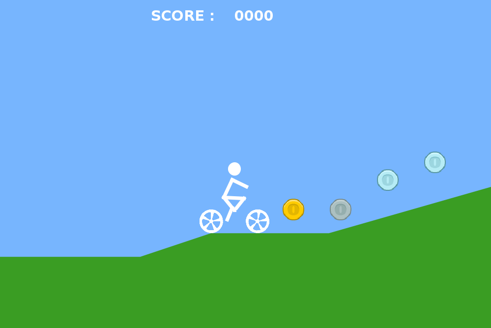

# BIKE GAME
This first project serves as a fist introduction to Java and uses the physics engine Jbox2D. 

The game itself is very simple, and is comprised of a single level. But be careful, there's a
trap!

## How to play
### Requirements
Java 8 is the only compatible version.

### Launching the game
To launch the game run the main in `src/main/java/Program.java`

### Game controls
`Up` : Forward  
`Down` : Stop  
`Left` : Angular Rotation  
`Right` : Angular Rotation

